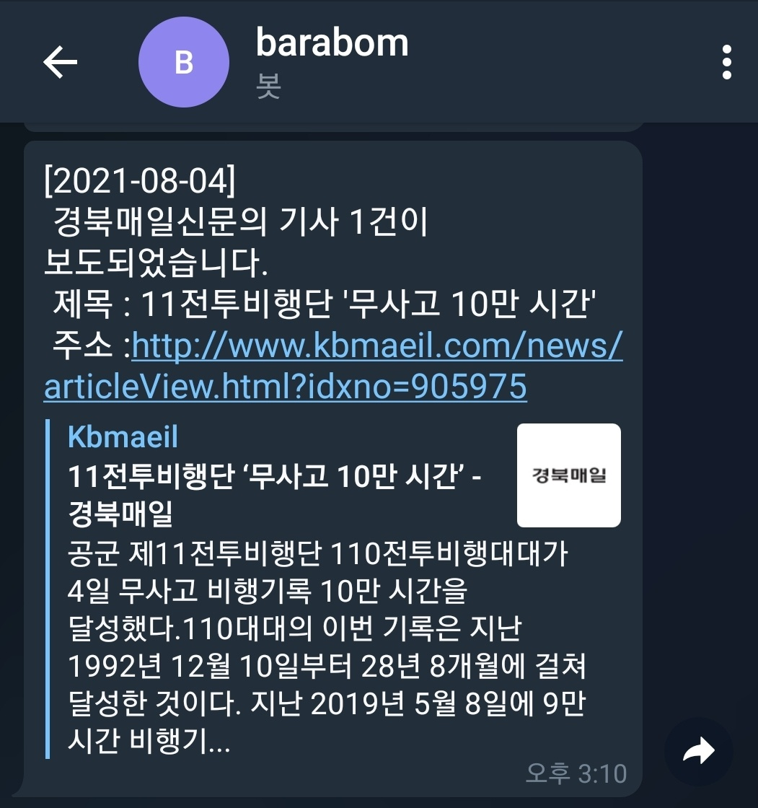

# 바라봄 프로젝트

## 바라봄 프로젝트란?
<!--Wirte one paragraph of project description -->  
네이버 뉴스 검색을 통한 언론 모니터링 자동화 프로그램입니다.
## Overview
<!-- Write Overview about this project -->
**기능**
- 키워드 기반 뉴스 기사 자동 검색
- 검색 기사 제목, 링크, 매체 DB 저장 
- 텔레그램 알림
- [구현예정] 긍부정 뉴스 분류 
- [구현예정] 각 기능별 통계 자료 제공

## 기능 예시

## Authors
  - [Daewonseo](https://github.com/daewonseo) - **Daewon Seo** - <sdw6908@gmail.com>

<!--
## Used or Referenced Projects
 - [referenced Project](project link) - **LICENSE** - little-bit introduce
-->
